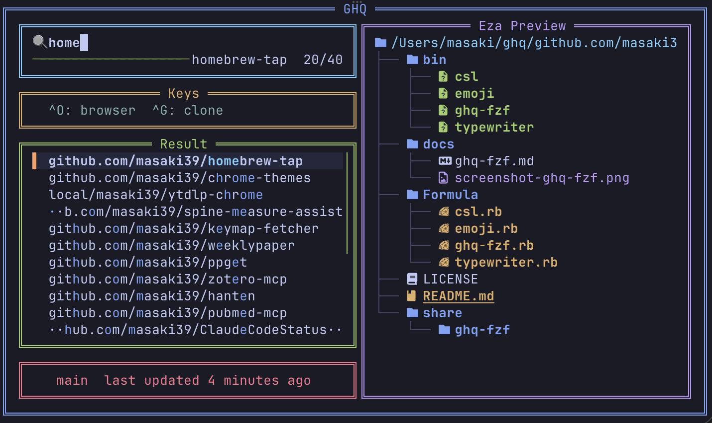

# ghq-fzf

A shell template for an interactive repository picker using [ghq](https://github.com/x-motemen/ghq) + [fzf](https://github.com/junegunn/fzf).  
Install once and use your own command name — no extra configuration needed.

---



---

## ✨ Features

- 🔍 **Fuzzy search** across all your ghq-managed repositories
- 🌲 **File tree preview** via `eza`
- 🌿 **Branch name + last updated** shown in the footer on focus
- 🌐 **Open in browser** with `Ctrl-O` (uses `gh`)
- 📥 **Clone a new repository** with `Ctrl-G` (`ghq get`) and `cd` into it
- 🎨 **Tokyo Night color theme** out of the box

## 📦 Requirements

The following tools are installed automatically as dependencies:

| Tool | Purpose |
|------|---------|
| [fzf](https://github.com/junegunn/fzf) 0.57+ | Fuzzy finder UI |
| [ghq](https://github.com/x-motemen/ghq) | Repository manager |
| [eza](https://github.com/eza-community/eza) | File tree preview |
| [gh](https://cli.github.com/) | Open repo in browser |

> [!NOTE]
> `Ctrl-O` (open in browser) requires `gh auth login` to be completed in advance.

## 🚀 Installation

```sh
brew tap masaki39/tap
brew install masaki39/tap/ghq-fzf
ghq-fzf install
```

`ghq-fzf install` will ask for your preferred command name and add the shell integration to `~/.zshrc` automatically.

```
🔧 ghq-fzf shell integration setup

Command name (e.g. gv): gv

✓ Installed in ~/.zshrc
Restart your shell or run: source ~/.zshrc
```

**Manual setup** — if you prefer to edit `~/.zshrc` directly:

```zsh
export GHQ_FZF_FUNC='gv'
source "$(brew --prefix)/share/ghq-fzf/init.zsh"
```

## 🎮 Usage

Type your command name (e.g. `gv`) to open the picker and `cd` into the selected repository.

### In-picker keys

| Key | Action |
|-----|--------|
| `Enter` | `cd` into the selected repository |
| `Ctrl-O` | Open the repository in your browser |
| `Ctrl-G` | Clone a new repository (`ghq get`) and `cd` into it |
| `Esc` / `Ctrl-C` | Close without changing directory |

## ⚙️ Customization

To change your command name, run `ghq-fzf install` again (overwrites the existing setting), or edit `~/.zshrc` directly:

```zsh
export GHQ_FZF_FUNC='repo'  # change to any name you like
```

## 🔄 Update

```sh
brew update && brew upgrade masaki39/tap/ghq-fzf
```

## 🗑️ Uninstall

```sh
ghq-fzf uninstall    # removes shell integration from ~/.zshrc
brew uninstall masaki39/tap/ghq-fzf
```
